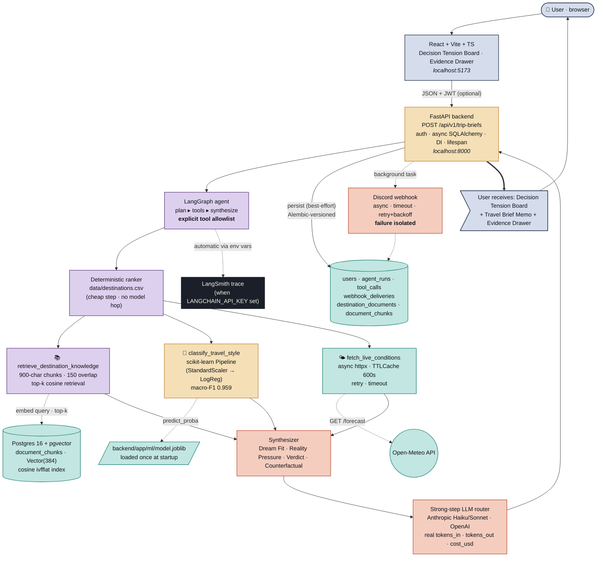

# AtlasBrief — Architecture Diagram

A high-density rendering of the live system. Every box maps to a real
file in this repo; every arrow maps to a real call.

To present this visually, open
[`docs/architecture_diagram.html`](architecture_diagram.html) in a
browser — that's the styled, screenshot-ready version (warm parchment +
brass / verdigris / terracotta palette, matching the rest of the
product). The Mermaid graph below renders inline on GitHub for
reviewers who prefer to read the source.

---

---

## What every layer does — file map

| # | Layer | File / location |
|---|---|---|
| 1 | Frontend (React + Vite) | [`frontend/src/App.tsx`](../frontend/src/App.tsx), [`frontend/src/components/DecisionTensionBoard.tsx`](../frontend/src/components/DecisionTensionBoard.tsx) |
| 2 | FastAPI route | [`backend/app/api/routes/trip_briefs.py`](../backend/app/api/routes/trip_briefs.py) |
| 3 | LangGraph agent | [`backend/app/agent/graph.py`](../backend/app/agent/graph.py), allowlist [`registry.py`](../backend/app/agent/registry.py) |
| 4a | Cheap step (deterministic ranker) | [`backend/app/llm/router.py`](../backend/app/llm/router.py) |
| 4b | RAG tool · pgvector | [`backend/app/tools/retrieve_destination_knowledge.py`](../backend/app/tools/retrieve_destination_knowledge.py), retriever [`backend/app/rag/retriever.py`](../backend/app/rag/retriever.py) |
| 4c | ML tool · joblib | [`backend/app/tools/classify_travel_style.py`](../backend/app/tools/classify_travel_style.py), trainer [`backend/app/ml/train_classifier.py`](../backend/app/ml/train_classifier.py) |
| 4d | Live-conditions tool | [`backend/app/tools/fetch_live_conditions.py`](../backend/app/tools/fetch_live_conditions.py), TTL cache [`backend/app/cache/ttl.py`](../backend/app/cache/ttl.py) |
| 5 | Synthesizer + strong step | [`backend/app/agent/synthesize.py`](../backend/app/agent/synthesize.py), providers [`backend/app/llm/providers.py`](../backend/app/llm/providers.py) |
| 6 | Persistence (Postgres + pgvector) | [`backend/app/db/`](../backend/app/db/), [`backend/app/models/`](../backend/app/models/), Alembic [`backend/alembic/versions/0001_initial.py`](../backend/alembic/versions/0001_initial.py) |
| 7 | Discord webhook | [`backend/app/webhooks/dispatcher.py`](../backend/app/webhooks/dispatcher.py) |
| 8 | LangSmith tracing | [`backend/app/tracing.py`](../backend/app/tracing.py) |

---

## 3-minute talk script (rehearsed against this diagram)

**0:00 – 0:25 · Frame.**
> "AtlasBrief takes a fuzzy travel question and returns a *defended*
> recommendation. The signature output is the **Decision Tension Board** —
> Dream Fit, Reality Pressure, Final Verdict, Counterfactual. One query
> in, one tradeoff named."

**0:25 – 0:55 · Frontend → backend.** *(point to layers 1 + 2)*
> "The user lands on a React + Vite single-page briefing room and submits
> one query. It hits a single FastAPI endpoint. Auth is bcrypt + JWT but
> optional — the demo path stays anonymous. Everything is async — no
> `requests.get`, no `time.sleep` in the request path. Pydantic validates
> at every boundary."

**0:55 – 1:50 · Agent + three tools.** *(point to layers 3, 4)*
> "The route hands off to a small LangGraph agent: plan, tools,
> synthesize. The planner is a deterministic ranker over our 131-row
> destinations CSV — no model hop for mechanical work. It picks the
> destination, the counterfactual, and the feature profile.
>
> Three tools fire, exactly the three the brief asks for, behind an
> explicit allowlist. **RAG** retrieves from 28 markdown briefs across
> 14 destinations, embeddings stored in Postgres + pgvector with a
> cosine ivfflat index. **ML classifier** is a scikit-learn pipeline,
> StandardScaler plus Logistic Regression, mean macro-F1 0.959 on
> stratified 5-fold CV — loaded once at startup via FastAPI lifespan.
> **Live conditions** is an async Open-Meteo lookup behind a TTL cache
> with stampede protection. If a tool fails, the failure is structured
> and the LLM can reason about it — the request never crashes."

**1:50 – 2:20 · Two-model routing + cost.** *(point to layer 5)*
> "Cheap step is deterministic. Strong step calls real Anthropic Haiku
> or Sonnet — or OpenAI — when a key is set; falls back to a
> deterministic verdict otherwise. We log real `tokens_in`,
> `tokens_out`, and `cost_usd` per request. Live-measured with Haiku:
> $0.001361 per query. LangSmith captures the full multi-tool trace
> when the key is in `.env`."

**2:20 – 2:50 · Persistence + webhook.** *(point to layers 6, 7)*
> "Six tables in Postgres, async SQLAlchemy 2.x, schema versioned with
> Alembic that enables pgvector before creating the chunk table. The
> `pgdata` named volume keeps embeddings and history across restarts.
> After the response is sent, a background task fires a Discord webhook
> with timeout, retry, and backoff. Webhook failure never breaks the
> user response — that's tested in `tests/test_webhook.py`."

**2:50 – 3:00 · Close.**
> "One Docker command — `docker compose up` — brings up the whole
> stack. CI runs ruff plus 58 pytest tests on every push. That's
> AtlasBrief."
